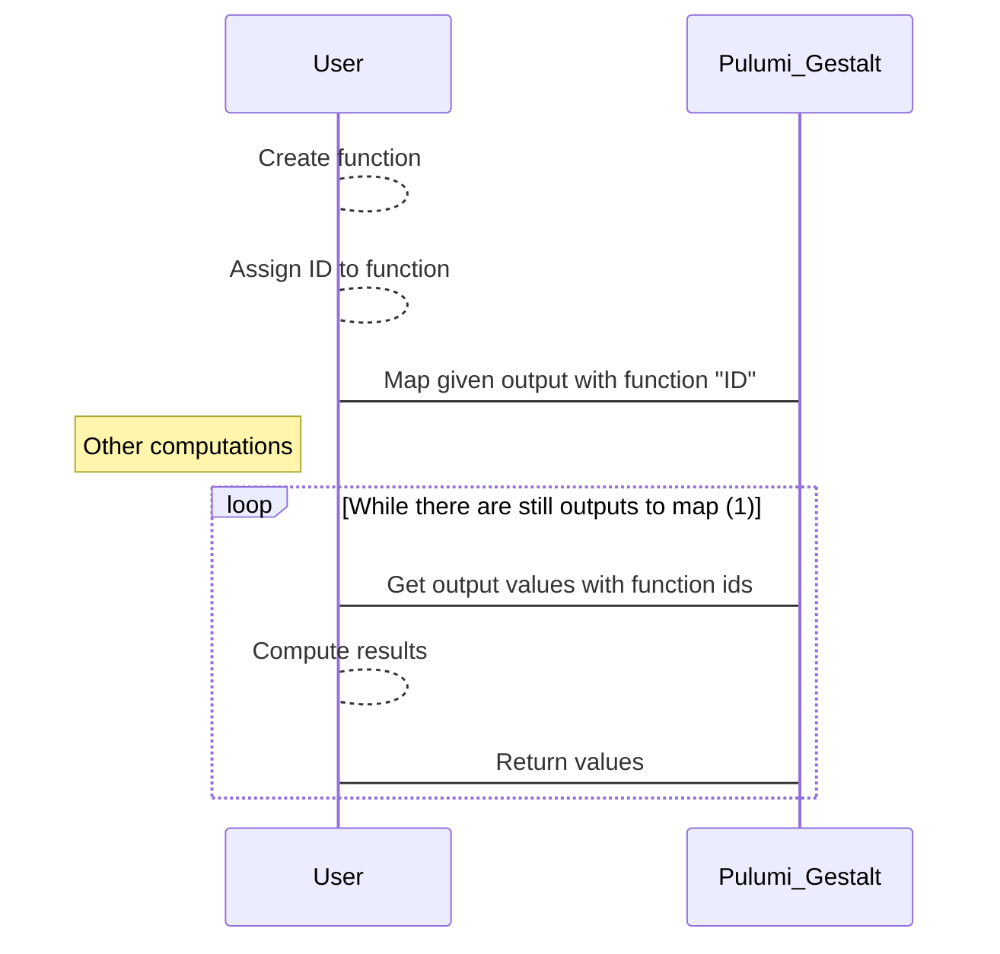

# Outputs

## Types of Output

Pulumi Wasm has 5 types of outputs (represented as `EngineNode` in `engine.rs`):
1. Done
2. NativeFunction
3. RegisterResource
4. ExtractField
5. CombineOutputs

### Done

This is output for which value is known. Internally it's represented as JSON's `Value`.

### NativeFunction

This is output which wait to be mapped by host. More details are in [Mapping](#Mapping) section. Internally it's represented as tuple of function name and output which will values will be it's argument.

### RegisterResource

Output that will eventually be sent to Pulumi as register resource instruction. This is internal to pulumi-gestalt and is not exposed to user

### ExtractField

Step 2 of RegisterResource. This output will take response of register resource and extract one field.

### CombineOutputs

Output that combines N outputs and returns array (in user facing code it should be a tuple)

## Mapping

One of Pulumi features is allowing transforming values in programming languages as opposed to 
configuration language like in Terraform. While it's obvious how to do that when everything is written in one language
in Pulumi Wasm it's not the case - internals are written in Rust compiled to Wasm, while user code
can be written in any language that can be compiled to Wasm. 

To handle it mapping value has 2 stages:

1. Save function in global map (in functional languages it may be monad)
2. Iterating over all values that be mapped and invoking function on it.

Simplified sequence diagram of this process:

(1) Outputs ready to be mapped are of type `Func` for which input is type `Done`

Currently due to single threaded nature of Wasm this operation is done at the end of the program.