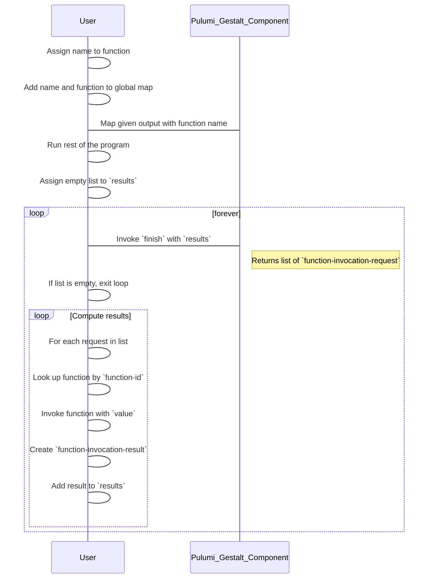

# Wasm

!!! note "Please Read First"
    Before proceeding, make sure to read [Pulumi Gestalt integrations Overview](overview.md) page to get a better
    understanding of the documentation.

In Pulumi Gestalt, Wasm support is based on the [Component Model](https://component-model.bytecodealliance.org/).

## Artifacts

Several artifacts related to Wasm support can be found on
the [releases](https://github.com/andrzejressel/pulumi-gestalt/releases/) page:

- **Wasm implementation** (`pulumi_gestalt-debug.wasm` / `pulumi_gestalt-release.wasm`)
- **Runner** (`pulumi_gestalt_wasm_runner`)
- **WIT files** (`world.wit`, `pulumi-gestalt-external.wit`)

The key artifacts are the **Runner** and **WIT files**. The Runner automatically downloads the corresponding Wasm
implementation from the releases page when the program is executed.

## Versioning

Currently, WIT files follow nightly versioning. Integrations should select a nightly version of Pulumi Gestalt to ensure
compatibility. The Runner downloads the corresponding Wasm implementation and merges them into a single Wasm file.

## Entrypoint

The entry point is managed by the `component:pulumi-gestalt-external/pulumi-main` interface. This function is invoked by
`pulumi-gestalt-runner`. It takes a single argument, `in-preview`, which should be passed to
the context constructor.

## Callback Emulation

In Pulumi, one of the key features is the ability to invoke arbitrary code for Output mapping. Typically, an Output
would be implemented as a `Future<T>` abstraction with a `map` method. However, this introduces a circular dependency:
user code needs `Future<T>.map`, but `Future<T>.map` needs user code. While this is not a problem in most languages, it
is an issue in the WebAssembly (Wasm) Component Model due to its lack of support for circular dependencies.

To address this, Pulumi Gestalt uses a callback emulation mechanism where user code must manually retrieve a list of
required callbacks, invoke them, and return the results. This is done using the `finish` function, which has the
following signature:

```wit
interface types {
    record function-invocation-request {
        id: output,
        function-name: string,
        value: string,
    }
    record function-invocation-result {
        id: borrow<output>,
        value: string,
    }
}
interface output-interface {
    resource output {
        map: func(function-name: string) -> output;
    }
}
interface context {
    resource context {
        finish: func(functions: list<function-invocation-result>) -> list<function-invocation-request>;
    }
}
```

The algorithm is as follows:



You can check implementation of this mechanism inside `Pulumi Gestalt` itself:
- [First implementation](https://docs.rs/pulumi_gestalt_rust_integration/latest/pulumi_gestalt_rust_integration/struct.Context.html#method.finish)
- [Second implementation (`run_loop` function)](https://docs.rs/pulumi_gestalt_rust_adapter_wasm/latest/src/pulumi_gestalt_rust_adapter_wasm/runner.rs.html)

## Runner Quick Start

To execute a Pulumi Gestalt Wasm program using the Runner, use:

```sh
pulumi_wasm_runner run <WASM_FILE>
```

This downloads the corresponding Wasm implementation, merges it with the specified Wasm file, and runs the program. To
use the debug version of Wasm, add the `--debug` flag.

## WIT Files

```title="world.wit"
--8<-- "crates/wit/wit/world.wit"
```

```title="pulumi-gestalt-external.wit"
--8<-- "crates/wit/wit/deps/pulumi-gestalt-external.wit"
```

The relevant integration world for Pulumi Gestalt is `client`.
